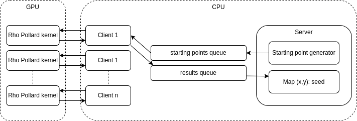
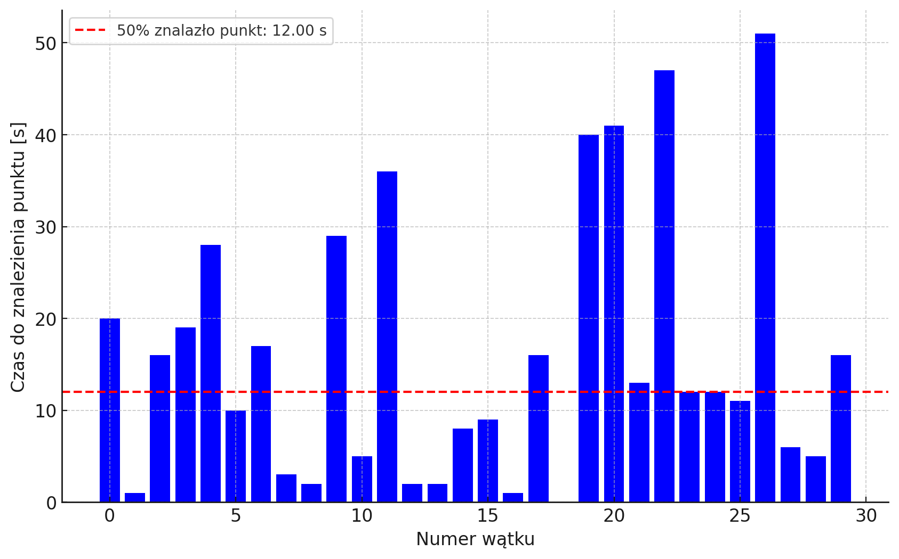
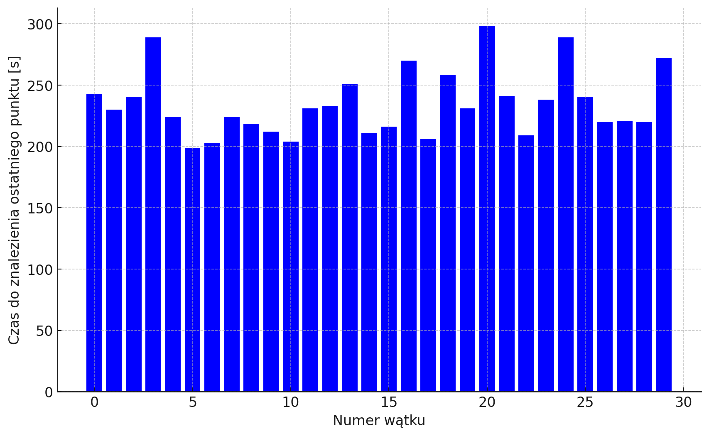

# CUDA-rho-pollard

## Overview

This project was my final project/thesis for a BSc at Warsaw University of Technology.
It is an implementation of a system for solving the _Elliptic Curve Discrete Logarithm Problem (ECDLP)_
using GPU acceleration with CUDA. It is designed for the **ECCp79 curve**
from the Certicom Challenge, achieving **87.7 million operations per second**,
solving the problem in approximately **3 hours** on an **Nvidia GTX 2070 Super**

## Features

- **CUDA-based GPU acceleration**
- **Pollard’s Rho Algorithm** for ECDLP
- **Python-based server** for managing clients and results

## Architecture

The main part of the system is written in CUDA. It's responsible for performing a random walk on the curve
and finding distinguish points. To accumulate all points and find a collision,
there is a simple Python server. The client program acts as an interface between
CUDA code and Python using the _ctypes_ library.

## Requirements

- **NVIDIA GPU** with CUDA support
- **CUDA Toolkit** (v12.4)
- **Python 3.11+**
- **SageMath**

Note that the code is designed and optimized for my GPU (GTX 2070 Super).

## Usage

1. **Compile** the CUDA code using `CMake`.
2. **Run the server** to manage computations. `sage -python ./main.py`
4. **Obtain results** – the system outputs the recovered discrete logarithm.

## Interesting optimizations

A few interesting problems and their solutions that I found during my
work on this project.

### Tail Effect

The main problem with parallel Rho Pollard is that,
at its core, it is stochastic algorithm,
with random time before each distinguish point found.
This setup isn't well-aligned with the CUDA programming model.
When each block runs with hundreds of threads, it occupies space on the SM, until all threads
finish their job and return. When some threads work for much longer then others,
the efficiency of calculations drops because the new block with new data cannot start.
It causes effect known as
[_Tail Effect_](https://developer.nvidia.com/blog/cuda-pro-tip-minimize-the-tail-effect/).
To achieve better utilization during computation,
each thread computes
more than one distinguished point before finishing.\
Below is comparison from test run, where threads are looking for just **one**
distinguish point before return and **three** of them before return:

_(x axis: thread number, y axis: time before finding distinguish point)_\
After increasing the size of _starting points_ batch for each thread
(as well as expected number of distinguish points to find):

_(x axis: thread number, y axis: time before finding distinguish point)_\
The utilization increases, as most of computing time is spent for calculating next distinguish point,
instead of waiting for _anomalous_ rho pollard walk. The probability that one thread
will work significantly longer than others is reduced.

### CUDA Streams

Previous optimization was done on thread level, but even then, when each wave of computations
(think of each kernel start) is going to end, utilization of resources also decreases, as there
are no new blocks to jump in place of the finished ones. Naive approach will be to wait,
until kernel finishes and then starting the next one. But then the efficiency graph will
look like chain of sigmoid curves. Thanks to **CUDA Streams** and special flag `--default-stream per-thread`,
each Python client thread that launches the CUDA program has its own independent stream. CUDA Scheduler then
will take care of replacing finished blocks with the new ones from the queue.
Below is a graph, made by logging each found distinguish point
both with stream id during which it was found:

_(x axis: time, y axis: sum of found distinguish points (red: stream 1, orange: stream 2, yellow: total sum))_\
The transition of resources from the finishing stream to the new starting stream is visible.

### Montgomery trick

For faster computations of modular inverse, each thread calculates
modular inverse of multiple values at the same time, thanks to the technique
known as _Montgomery Trick_. To be even more efficient, each modular inverse is calculated
using the full capacity of _window_ array. So each thread actually performs Rho Pollard iteration for multiple points before the next step of the loop.
If, for example, the point at index 0 is found to be distinguished,
new starting point is loaded in its place and all the time each modular inverse operation is
done with the same number of points.

## Results with my setup

The achieved results match are very close to the theoretical expectations.
Expected number of accumulated distinguish points, before finding collision is given
be the equation:
$$
\frac{\sqrt{\pi*2^{79}}/2}{2^{20}} \sim 929262.5811
$$
The results from 5 trails (running whole setup at nights is too loud to make more :)), with
setup:
- `OS`: openSUSE Tumbleweed 20240812
- `CPU`: Intel Core i5-10600KF 4.10 GHz
- `RAM`: 16 GB
- `GPU`: GeForce RTX 2070 Super

| Trail       | Number of found distinguished points | Time of computations [s] |
| ----------- | ------------------------------------ | ------------------------ |
| 1           | 1 856 364                            | 22 195.42                |
| 2           | 791 747                              | 9 898.74                 |
| 3           | 770 077                              | 9 329.74                 |
| 4           | 1 163 047                            | 13 681.16                |
| 5           | 1 207 014                            | 15 001.94                |
| **Average** | 1 153 649                            | 14 021.00 (3.89 hour)    |

Average number of found points before collision is a bit
higher then expected number. It might be due to small number of trails,
and with more of them, the result will be closer to the theory.
Achieved number of Rho Pollard iterations per second: **87,7 milion**
